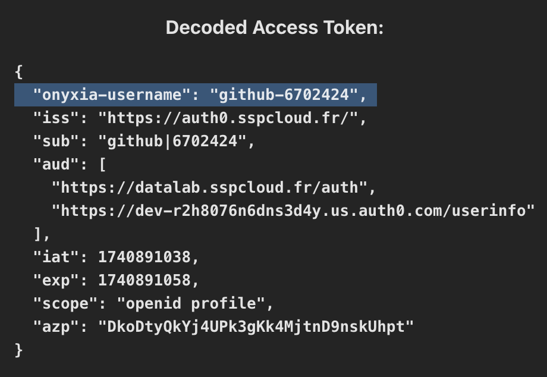
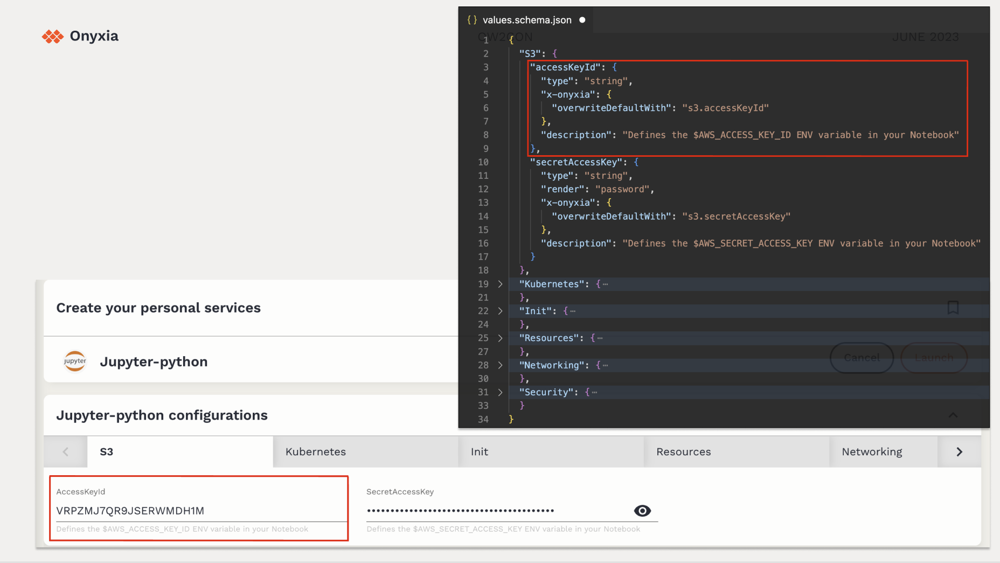

# Catalog of services

Onyxia ships with a set of **official service catalogs**.

If you don’t configure anything, these are the defaults:

<table data-view="cards"><thead><tr><th></th><th data-type="content-ref"></th><th data-hidden data-card-cover data-type="image">Cover image</th></tr></thead><tbody><tr><td>Interactive services (IDEs)</td><td><a href="https://github.com/inseefrlab/helm-charts-interactive-services">https://github.com/inseefrlab/helm-charts-interactive-services</a></td><td><a href="../../.gitbook/assets/Screenshot 2026-01-21 at 16.33.24.png">Screenshot 2026-01-21 at 16.33.24.png</a></td></tr><tr><td>Databases</td><td><a href="https://github.com/inseefrlab/helm-charts-databases">https://github.com/inseefrlab/helm-charts-databases</a></td><td><a href="../../.gitbook/assets/hero (1).webp">hero (1).webp</a></td></tr><tr><td>Automation</td><td><a href="https://github.com/InseeFrLab/helm-charts-automation/">https://github.com/InseeFrLab/helm-charts-automation/</a></td><td><a href="../../.gitbook/assets/mlflow-argo (2).png">mlflow-argo (2).png</a></td></tr><tr><td>Data visualization (optional)</td><td><a href="https://github.com/InseeFrLab/helm-charts-datavisualization">https://github.com/InseeFrLab/helm-charts-datavisualization</a></td><td><a href="../../.gitbook/assets/65dcd5fadc1df1b15af75c1e_Metabase vs Redash.png">65dcd5fadc1df1b15af75c1e_Metabase vs Redash.png</a></td></tr></tbody></table>

As an instance admin, you can heavily customize what users see and can do:

* Change defaults for a service (resources, images, features).
* Apply different policies per user group (example: who can request H100).
* Fork our catalogs or build your own.
* Turn any Helm-deployable software into a service.

Example: [Doom launched as an Onyxia service](https://youtu.be/7SuXRfQqdGM?si=2Y_jrQyW-fMfGn6M\&t=731).

## Mental model: Onyxia is a UI for Helm

If you already know Helm, most of this will feel familiar.

### Helm concepts (baseline)

* A **Helm repository** is a collection of Helm charts.
* A **Helm chart** is a recipe to deploy software on Kubernetes.
* Charts expose configuration via **values**.

Defaults live in `values.yaml`.

Example: [`values.yaml` (jupyter-python)](https://github.com/InseeFrLab/helm-charts-interactive-services/blob/main/charts/jupyter-python/values.yaml).

When installing a chart, you can override any default value.

Charts can also ship a `values.schema.json`.

This JSON Schema describes:

* which options exist
* the expected types / formats
* constraints (min/max, enums, patterns, …)

Example: [`values.schema.json` (jupyter-python)](https://github.com/InseeFrLab/helm-charts-interactive-services/blob/main/charts/jupyter-python/values.schema.json).

### How Onyxia uses Helm to build the UX

You configure which Helm repositories Onyxia should load as catalogs.


If you don’t configure catalogs, Onyxia loads the defaults from [`catalogs.json`](https://github.com/InseeFrLab/onyxia-api/blob/main/onyxia-api/src/main/resources/catalogs.json).


On the “Service catalog” page:

* Each **Helm repo** becomes a **tab** (Interactive services, Databases, Automation, …).
* Each **chart** becomes a **service card** (Jupyter, RStudio, …).

<figure><figcaption></figcaption></figure>

When a user opens a service:

* Onyxia reads the chart’s `values.schema.json`.
* It renders a form from the schema.
* It generates a final `values` object that Helm will apply.

Onyxia can also inject user-specific defaults. For example, it can prefill S3 credentials:

<figure><figcaption></figcaption></figure>

## Customizing the catalog

You have two main customization paths:

<table data-card-size="large" data-view="cards"><thead><tr><th></th><th data-type="content-ref"></th></tr></thead><tbody><tr><td>Instance-level overrides (recommended for most setups)</td><td><a href="override-schema-for-a-specific-instance.md">override-schema-for-a-specific-instance.md</a></td></tr><tr><td>Bring your own catalogs (or a fork of ours)</td><td><a href="custom-catalogs/">custom-catalogs</a></td></tr></tbody></table>
