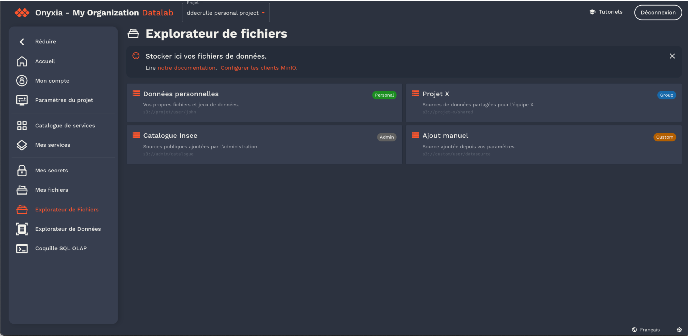

# May 2025 community call

Community call 05/29/2025

Project's news :

* Release v10.18 (including API 4.6.0) :
  * Basic auth for helm repo
  * Support for multiple S3 configurations (first step, still need more work especially on services / catalogs)
  * Ability to host and embed markdown files : [Issue](https://github.com/InseeFrLab/onyxia/pull/976) [Example](https://datalab.sspcloud.fr/document?source=%257B%2522en%2522%253A%2522%252Fcustom-resources%252Ftos_en.md%2522%252C%2522fr%2522%253A%2522%252Fcustom-resources%252Ftos_fr.md%2522%257D)
* WIP : User profile : https://github.com/InseeFrLab/onyxia/pull/980 . Feedback / usecases welcome
* WIP : bookmarks for file explorer : https://github.com/InseeFrLab/onyxia/issues/968

<figure><figcaption></figcaption></figure>
